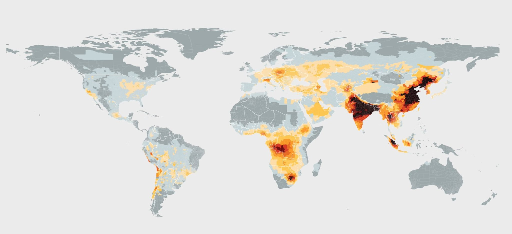
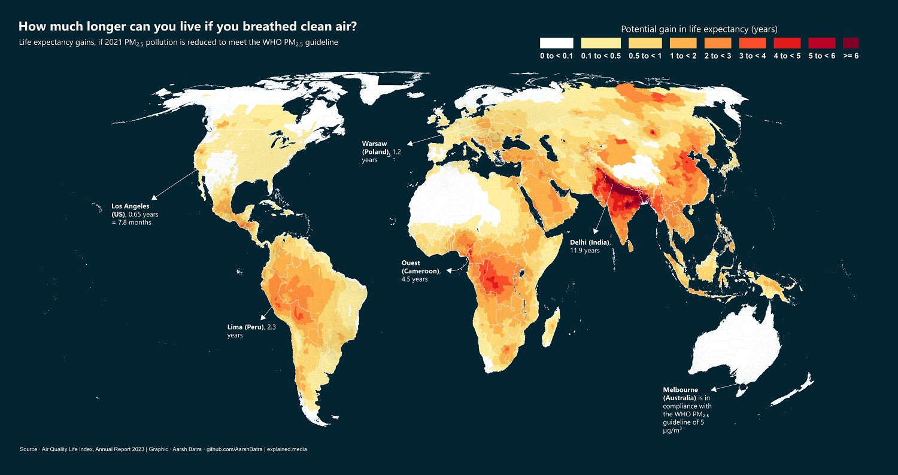

# Health4Earth — Aperçu du projet

## Dépôt GitHub
- URL du dépôt : https://github.com/JulienOllier/Health4Earth

## Composition du groupe
| Prénom            | Nom             | 
|-------------------|-----------------|
| Dossou Modeste    | AGOSSOU         | 
| Firdaousse        | KARIMOU         | 
| Julien            | OLLIER          | 

---

## Objectif du projet
Le projet **Health4Earth** vise à analyser les liens entre les émissions de CO₂, la pollution atmosphérique et 
la santé publique à l’échelle mondiale. Il s’inscrit dans les thématiques de l’écologie et de la santé globale.

## Question centrale
Comment les **émissions de CO₂** et la **pollution atmosphérique** influencent-elles la santé publique, notamment les **maladies 
respiratoires**, la **mortalité** et l'**espérance de vie** des populations à travers le monde ?

---

## Architecture du projet minimum viable
### Arborescence du dépôt
Health4Earth/

├── data/             # Données brutes et nettoyées

├── scripts/          # Scripts Python/R pour traitement et modélisation 

├── roadmap/          # README.qmd (ce rapport) 

├── docs/             # Rapport final, figures exportées

├── quarto_site/      # Site web interactif

│ ├── index.qmd

| ├── data.qmd 

│ ├── analysis.qmd 

│ ├── model.qmd 

│ ├── team.qmd 

├── requirements.txt # Dépendances Python 

├── .gitignore 

├── README.md        # Présentation du projet

├── quarto.yml       # Configuration du site

---

### Pipeline de développement
1. **Collecte des données** :
   - Our World in Data (OWID): émissions de CO₂, pollution atmosphérique
   - World Health Organization (WHO) : mortalité et espérance de vie liées à la pollution
   - Global Burden of Disease (GBD) : maladies respiratoires
   
2. **Nettoyage et fusion** :
   - Sélection des variables pertinentes
   - Harmonisation des formats et des unités

3. **Analyse exploratoire** :
   - Visualisations temporelles et géographiques
   - Corrélations pollution ↔ santé

4. **Modélisation** :
   - Régression linéaire pour prédire la mortalité
   - Validation croisée

5. **Site web Quarto** :
   - Pages interactives avec widgets
   - Déploiement via GitHub Pages

---

## Technologies utilisées
- **Python** : pandas, scikit-learn, plotly, folium
- **Quarto** : pour le site web interactif
- **Git & GitHub** : gestion collaborative
- **Mermaid** : diagramme de Gantt
- **Markdown/LaTeX** : rédaction technique

---

## Prototypes visuels :
Images simples (croquis, schémas, prototypes) montrant les résultats attendus :
- Série chronologique : évolution des émissions de CO₂ et de la pollution atmosphérique
- Carte interactive : mortalité et espérance de vie liées à la pollution par pays
- Scatter plot : PM2.5 ↔ mortalité

---

## Branches Git :
main : branche principale

dev : branche secondaire de développement

data : traitement et nettoyage des données

model : modélisation prédictive

site : développement du site Quarto

## Résultats attendus

L’interface du site web proposera une **carte interactive** des capitales mondiales. En cliquant sur une capitale, l’utilisateur pourra visualiser :

- Une courbe des émissions de CO₂
- Une courbe de pollution atmosphérique (PM2.5)
- Une courbe de mortalité liée à la pollution
- Une courbe d’espérance de vie

Voici les croquis et illustrations qui représentent ces objectifs :

