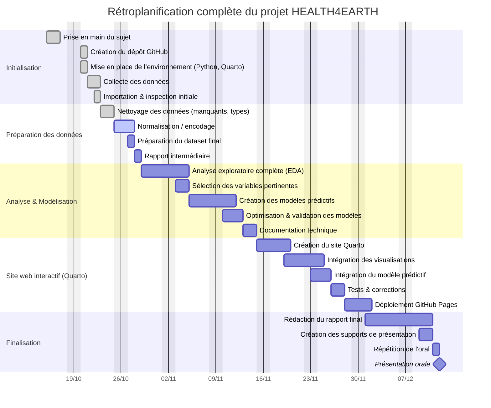

```mermaid
gantt
    title Rétroplanification complète du projet HEALTH4EARTH
    dateFormat  YYYY-MM-DD
    axisFormat  %d/%m
    todayMarker stroke-width:3px,stroke:#ff0000
    excludes    weekends

    %% -----------------------------
    %% PHASE 1 — INITIALISATION
    %% -----------------------------
    section Initialisation
    Prise en main du sujet                    :done,    2025-10-15, 2d
    Création du dépôt GitHub                  :done,    2025-10-20, 1d
    Mise en place de l’environnement (Python, Quarto) :done, 2025-10-20, 1d
    Collecte des données                      :done,    2025-10-21, 2d
    Importation & inspection initiale         :done,    2025-10-22, 1d

    %% -----------------------------
    %% PHASE 2 — PRÉPARATION DES DONNÉES
    %% -----------------------------
    section Préparation des données
    Nettoyage des données (manquants, types)  :done,    2025-10-23, 2d
    Normalisation / encodage                  :active,  2025-10-25, 2d
    Préparation du dataset final              :2025-10-27, 1d
    Rapport intermédiaire                     :2025-10-28, 1d

    %% -----------------------------
    %% PHASE 3 — ANALYSE & MODELISATION
    %% -----------------------------
    section Analyse & Modélisation
    Analyse exploratoire complète (EDA)       :2025-10-29, 5d
    Sélection des variables pertinentes        :2025-11-03, 2d
    Création des modèles prédictifs            :2025-11-05, 5d
    Optimisation & validation des modèles      :2025-11-10, 3d
    Documentation technique                    :2025-11-13, 2d

    %% -----------------------------
    %% PHASE 4 — SITE WEB INTERACTIF
    %% -----------------------------
    section Site web interactif (Quarto)
    Création du site Quarto                    :2025-11-15, 4d
    Intégration des visualisations             :2025-11-19, 4d
    Intégration du modèle prédictif            :2025-11-23, 3d
    Tests & corrections                        :2025-11-26, 2d
    Déploiement GitHub Pages                   :2025-11-28, 2d

    %% -----------------------------
    %% PHASE 5 — FINALISATION
    %% -----------------------------
    section Finalisation
    Rédaction du rapport final                 :2025-12-01, 8d
    Création des supports de présentation       :2025-12-09, 2d
    Répétition de l'oral                       :2025-12-11, 1d
    Présentation orale                         :milestone, 2025-12-12, 0d
```