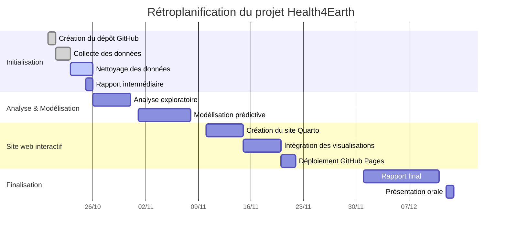

```mermaid
gantt
    title Rétroplanification du projet Health4Earth
    dateFormat  YYYY-MM-DD
    axisFormat  %d/%m
    todayMarker off

    section Initialisation
    Création du dépôt GitHub        :done, 2025-10-20, 1d
    Collecte des données            :done, 2025-10-21, 2d
    Nettoyage des données           :active, 2025-10-23, 3d
    Rapport intermédiaire           :2025-10-25, 1d

    section Analyse & Modélisation
    Analyse exploratoire            :2025-10-26, 5d
    Modélisation prédictive         :2025-11-01, 7d

    section Site web interactif
    Création du site Quarto         :2025-11-10, 5d
    Intégration des visualisations  :2025-11-15, 5d
    Déploiement GitHub Pages        :2025-11-20, 2d

    section Finalisation
    Rapport final                   :2025-12-01, 10d
    Présentation orale              :2025-12-12, 1d
```