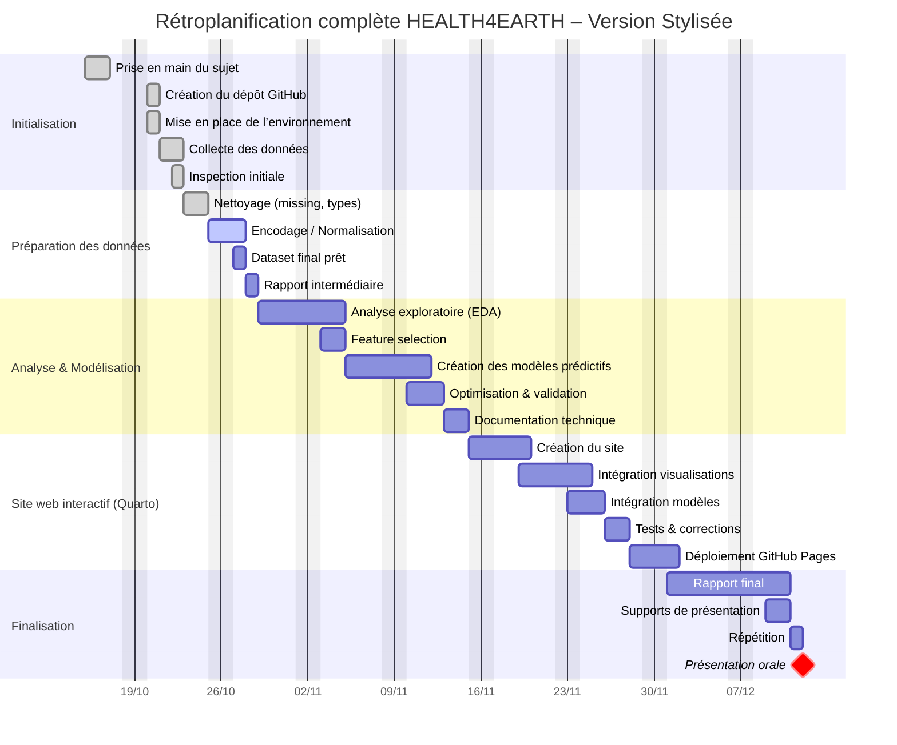

```mermaid

%%{init: {
    "theme": "default",
    "themeVariables": {
        "background": "#ffffff"
        "primaryColor": "#4CAF50",
        "primaryBorderColor": "#2E7D32",
        "primaryTextColor": "#fff",
        "secondaryColor": "#81C784",
        "secondaryTextColor": "#fff",
        "tertiaryColor": "#A5D6A7",
        "noteBkgColor": "#E8F5E9",
        "noteTextColor": "#1B5E20",
        "taskTextColor": "#1B5E20",
        "taskBkgColor": "#C8E6C9",
        "doneTaskBkgColor": "#9CCC65",
        "doneTaskTextColor": "#1B5E20",
        "activeTaskBkgColor": "#FFEB3B",
        "activeTaskTextColor": "#000",
        "critColor": "#E53935",
        "critBorderColor": "#B71C1C"
    }
}}%%

gantt
    title Rétroplanification complète HEALTH4EARTH – Version Stylisée
    dateFormat  YYYY-MM-DD
    axisFormat  %d/%m
    todayMarker stroke-width:3px,stroke:#FF0000
    excludes    weekends

    %% -----------------------------
    %% PHASE 1 — INITIALISATION
    %% -----------------------------
    section Initialisation
    Prise en main du sujet                    :done,    2025-10-15, 2d
    Création du dépôt GitHub                  :done,    2025-10-20, 1d
    Mise en place de l’environnement          :done,    2025-10-20, 1d
    Collecte des données                      :done,    2025-10-21, 2d
    Inspection initiale                       :done,    2025-10-22, 1d

    %% -----------------------------
    %% PHASE 2 — PREP & CLEANING
    %% -----------------------------
    section Préparation des données
    Nettoyage (missing, types)                :done,    2025-10-23, 2d
    Encodage / Normalisation                  :active,  2025-10-25, 2d
    Dataset final prêt                        :2025-10-27, 1d
    Rapport intermédiaire                     :2025-10-28, 1d

    %% -----------------------------
    %% PHASE 3 — ANALYSE & MODEL
    %% -----------------------------
    section Analyse & Modélisation
    Analyse exploratoire (EDA)                :2025-10-29, 5d
    Feature selection                         :2025-11-03, 2d
    Création des modèles prédictifs           :2025-11-05, 5d
    Optimisation & validation                 :2025-11-10, 3d
    Documentation technique                   :2025-11-13, 2d

    %% -----------------------------
    %% PHASE 4 — SITE WEB
    %% -----------------------------
    section Site web interactif (Quarto)
    Création du site                          :2025-11-15, 4d
    Intégration visualisations                :2025-11-19, 4d
    Intégration modèles                       :2025-11-23, 3d
    Tests & corrections                        :2025-11-26, 2d
    Déploiement GitHub Pages                  :2025-11-28, 2d

    %% -----------------------------
    %% PHASE 5 — FINALISATION
    %% -----------------------------
    section Finalisation
    Rapport final                             :2025-12-01, 8d
    Supports de présentation                  :2025-12-09, 2d
    Répétition                                :2025-12-11, 1d
    Présentation orale                        :milestone, crit, 2025-12-12, 0d
```